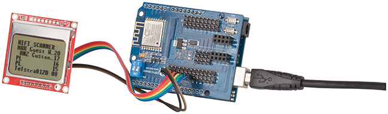
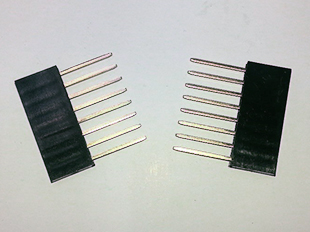
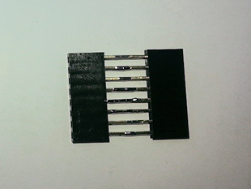
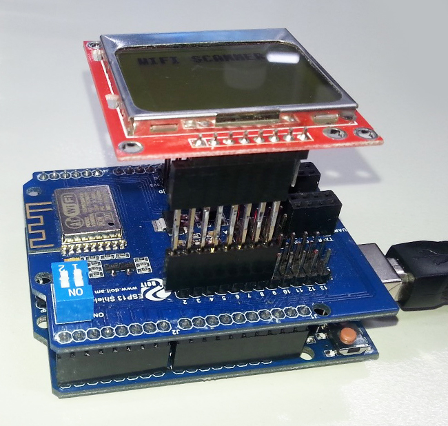

# Duinotech WiFi Scanner

This is a simple tool using just four Duinotech parts that can sit on your workbench and quickly tell you what WiFi networks are nearby and their relative strengths. If you're always working with different WiFi networks like we are, or even have a few XC4614's running in hotspot mode, it's handy to know which networks are up and which are not.

## Features:

* Displays 5 most powerful WiFi networks nearby.
* Shows relative strength.
* Automatic update every 5 seconds.
* No soldering needed.



## Shopping list:

[XC4410 Uno Main Board](p/XC4410)
[XC4614 WiFi Shield](p/XC4614)
[XC4616 84x48 Dot Matrix LCD Display](p/XC4616)
[WC6026 Socket-Socket Jumper Leads](p/WC6026)

Alternatively, if you don't mind soldering, and you'd like the display fixed rigidly to the shield, you can replace the jumper leads with a pair of 8-way headers from HM3207 soldered back-to-back.

## Connections:

As with all project involving shields, wiring is straightforward. The shield is plugged into the top of the Uno, and then eight of the jumper leads are run from shield to the display.


|Uno |WiFi |LCD |Function |Colour wire
|---|---|---|---|---
|5V |5V ||Power ||
|GND |GND| |Ground| |
|D0 (RX) |RX| |Data from shield| |
|D1 (TX) |TX| |Data to shield| |
|D2 ||VCC |Power to LCD |Black
|D3 ||GND |Ground for LCD |Brown
|D4 ||SCE |Serial Chip Enable |Red
|D5 ||RST |Reset |Orange
|D6 ||D/C |Data/Command |Yellow
|D7 ||DN(MOSI) |Serial Data |Green
|D8 ||SCLK |Serial Clock |Blue

The colour codes are not absolutely necessary, but will make it easier to follow the wiring as it is built. They are also easily separated as a group from the pack of jumper leads. By default, the LED backlight is not set to light up (because it needs 3.3V, but the Uno board runs on 5V). If you would like the LED to light up, connect the LED pin on the LCD to one of the 3V3 pins on the 'ESP13' side of the board.

## Code Upload:

There are no external libraries to download- everything is included in the Sketch section below (it's a fairly long sketch because it even includes font bitmap data). Once all the connections are made, ensure that the small switches labelled 1 and 2 on the WiFi shield are switched off by moving them away from the ON label. This frees up the Arduino serial port for uploading. Select the Uno board and correct serial port, load the sketch and press upload. If the upload occurs successfully, turn the small white switches back to on, and reset the Uno. If the screen comes up blank, check the wiring between the screen and the shield. If the screen shows 'No Networks...' or gets stuck on'Starting...', and there are networks in range, then double check the switch positions and try unplugging and replugging the Uno power.

## How it Works:

The WiFi shield provides most of the smarts in detecting the WiFi networks, the Uno simply tells the shield what to do and displays the results.

The commands that are sent to the shield are as follows:
```
ATE0:
```
Tells the shield to not echo back commands that are issued to it. This just simplifies the serial communication because there is less data going back and forth.
```
AT+CWMODE=1:
```
This command to tell the shield to only behave as a station, and not an access point. Again, because the shield isn't busy trying to provide an access point, it has more time to do what we want it to do.
```
AT+CWLAP:
```
This is the command that does most of the work, and asks the shield to return data about the access points that are nearby. Each line of data looks like below:
```
+CWLAP:(3,"Arduino",-41,"74:da:38:3c:71:99",1,-47)
```
The SSID name is that data between the first and second quote marks, and the SSID strength (RSSI) is between the second and third quote marks, which is how the sketch finds it. The sketch waits for five seconds for whatever data comes from the shield, and then processes it. First it separates the SSID name and strength and stores them, then it converts the strength from a negative number between -99 and -1 to a positive number between 1 and 99, and displays the five most powerful networks in order. If no network is found (which is what it will also think if the white switches are turned off), then the 'No Networks...' message is displayed.

## Improvements:

To create a more rigid assembly, solder together two of the eight-way headers from the HM3207 pack:





The below photo shows how the WiFi Scanner looks when it is assembled using the HM3207 to give a more compact arrangement. Note how we only use the last seven pins of the header adapter so that the LED pin is not connected.



Note that you still have to run a jumper lead to a 3.3V pin if you want the LED backlight on.

Other information that comes from the +CWLAP command includes:

Security type is the first number after the bracket. The number decodes as
`0=OPEN`,
`1=WEP`,
`2=WPA_PSK`,
`3=WPA2_PSK`,
`4=WPA_WPA2_PSK`.

MAC address of the access point is between the second pair of quote marks. This can be used to distinguish two access points with the same name.

The channel number and frequency offset are the last two numbers, but we find they aren't really much use in most applications.

You could display more of this information- for example, looking for security=0 so you can sniff out open WiFi hotspots.

This project really only uses the very basic functions of the XC4614 WiFi shield, and we hope to do some more advanced projects soon.
